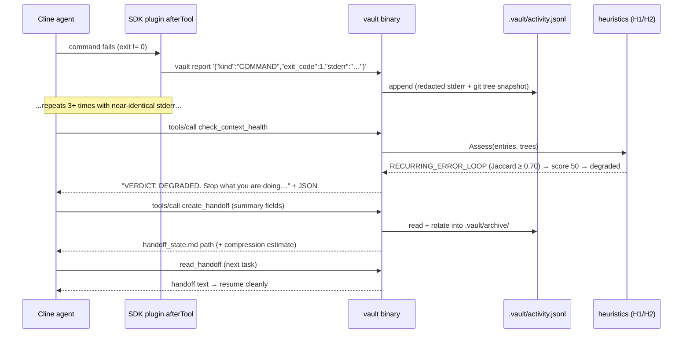

# Vault — Architecture

Vault is a pure-Go (1.21+, stdlib-only) MCP server that detects **AI-agent
context rot** locally and deterministically, then writes a handoff file so a
fresh session can resume cleanly. Everything below is current as of
Phase 7.

## System overview

```mermaid
flowchart LR
    A[Cline agent<br/>runs commands/edits] -->|afterTool hook| B[SDK plugin<br/>.cline/plugins/vault-telemetry]
    B -->|spawns| C["vault report '&lt;json&gt;'"]
    C -->|appends| D[.vault/activity.jsonl]
    D --> E[heuristics<br/>H1 error loop · H2 churn]
    E --> F["check_context_health"]
    F -->|score + verdict| G[VERDICT: HEALTHY / DEGRADED]
    G -->|degraded| H[create_handoff]
    H --> I[.vault/handoff_state.md<br/>+ archive rotation]
    I -->|fresh task| J[read_handoff]
```



One full degrade-and-handoff cycle:



## Package map

- **`cmd/vault`** (`main.go:1-120`, `mcp_register.go:1-189`) — the
  entrypoint. With no arguments it boots the stdio MCP server; subcommands
  `health` (raw JSON), `report '<json>'` (telemetry route), and the hidden
  `mcp-register` (install/uninstall of the MCP settings entry) cover the
  CLI surface.
- **`internal/mcp`** (`mcp.go:1-160`, `tools.go:1-108`) — the JSON-RPC 2.0
  transport: line-delimited stdio, strict stdout discipline (logs go to
  stderr), notifications unanswered, parse errors `-32700`, unknown methods
  `-32601`, and the four tool schemas.
- **`internal/state`** (`state.go:1-236`, `handoff.go:1-318`) — persisted
  state under `<root>/.vault/`: the append-only `activity.jsonl`, the
  health aggregation and verdict directive, the handoff writer (atomic
  write, redaction, compression footer), and activity rotation into
  `.vault/archive/`.
- **`internal/heuristics`** (`heuristics.go:1-212`, `churn.go:1-208`,
  `assess.go:1-143`, `redact.go:1-43`) — pure, offline detection: text
  normalization + Jaccard (H1), git-tree snapshot churn (H2), the
  score/status aggregator, and regex redaction. No network, no LLM.
- **`.cline/plugins/vault-telemetry`** (`index.ts:1-253`) — the SDK plugin.
  Its `afterTool` hook intercepts terminal-command tools and file-edit
  tools, and spawns `vault report '<json>'` so every record (and its git
  snapshot) goes through the Go server. Observational only: it never
  throws and never mutates tool results.

## Data formats

**`.vault/activity.jsonl`** — one JSON object per line:

```json
{"time":"2026-10-04T10:00:00Z","kind":"COMMAND","command":"go test ./...",
 "exit_code":1,"stderr":"…redacted…","files":["a.go"],"workspace":"/abs/path","tree":"4b825d…"}
```

- `kind` ∈ READ | EDIT | COMMAND | TEST | COMMIT (READ rows have no `tree`).
- `stderr` is already redacted at write time.

**`.vault/handoff_state.md`** — fixed H2 section order: `# Vault Handoff` +
resume line, then `## Goal`, `## Architecture & Decisions`, `## Touched
Files & AST Scope`, `## Completed Work`, `## Current Blocker & Active
Errors`, `## Failed Attempts (Do Not Repeat)`, `## Next Immediate Action`,
`## Git State & Checkpoint Tag`, and a final
`Vault Compression Estimate: …` footer.

**Health JSON** (`check_context_health` payload after the verdict line):

```json
{"score":100,"status":"healthy","flags":[],
 "reason":"no context-rot signals detected.","recommendation":"continue",
 "metrics":{"similarities":[],"net":0,"gross":0,"efficiency":0,"activity_count":13}}
```

## Heuristics in detail

### H1 — recurring error loop

1. **Normalize** each failing output: lowercase; strip paths, hex
   addresses, RFC3339 timestamps, clocks, durations and bare numbers; drop
   Go-test boilerplate lines (`PASS`, `=== RUN`, `exit status N`, …);
   split on non-alphanumerics; keep tokens ≥ 2 chars; de-duplicate into a
   sorted set.
2. **Candidate rule:** the last 3 `COMMAND`/`TEST` entries must all fail
   (`exit_code != 0`) with non-empty output.
3. **Similarity:** pairwise Jaccard on the three token sets:
   `J(A,B) = |A∩B| / |A∪B|` (both-empty = 0).
4. **Flag:** all three pairs ≥ **0.70** (`VAULT_JACCARD_MIN`) →
   `RECURRING_ERROR_LOOP` with pairwise similarities + shared tokens as
   evidence.

### H2 — code oscillation (git-tree churn)

Snapshots are taken by copying the worktree's index file to a temp file,
setting `GIT_INDEX_FILE` to that temp copy, then running `git add -A` +
`git write-tree`. The real index is **never touched**, and
`git rev-parse --git-path index` resolves the per-worktree index so git
worktrees are safe. Failures (non-repo, missing git) return `""` and are
ignored downstream. READ activities skip the snapshot entirely.

- `gross` = Σ over consecutive snapshot pairs of (added + deleted lines)
  from `git diff --numstat`.
- `net` = added + deleted between the first and last snapshot.
- `efficiency` = `net / gross` (0 when gross = 0).
- **Flag:** `efficiency < 0.15` AND (`gross > 100` OR ≥ 10 distinct
  snapshots) → `CODE_OSCILLATION_THRASHING`. The snapshot gate catches
  micro-oscillation (flipping one line back and forth 12 times = gross 24
  but 12 snapshots).

Worked example: snapshots A→B→A→B with 100 lines changed each hop:
gross = 100+100+100 = 300, net = diff(A→B) = 100, efficiency = 0.33 —
*not* flagged. If the net change were 20 lines over the same hops:
efficiency = 20/300 ≈ 0.07 → flagged (the agent thrashed 300 lines to move
20).

### Scoring

| Signal | Penalty |
|---|---|
| RECURRING_ERROR_LOOP | −50 |
| CODE_OSCILLATION_THRASHING | −35 |

Score starts at 100, clamped to [0,100]. Status: `healthy` ≥ 70,
`degraded` ≥ 40, else `critical`. `check_context_health` renders both
degraded and critical as the stop-and-handoff directive.

### Environment overrides

| Variable | Default | Meaning |
|---|---|---|
| `VAULT_JACCARD_MIN` | 0.70 | H1 similarity threshold |
| `VAULT_CHURN_MIN_GROSS` | 100.0 | H2 line-churn threshold |
| `VAULT_CHURN_MAX_EFF` | 0.15 | H2 net/gross ceiling |
| `VAULT_CHURN_MIN_SNAPSHOTS` | 10 | H2 micro-oscillation gate |
## Design decisions (and what we rejected)

1. **stdio MCP over HTTP.** MCP over stdio JSON-RPC is what Cline natively
   spawns; an HTTP server would add a port, auth questions, and lifecycle
   management for zero benefit. (An HTTP dashboard was briefly built in
   Phase 4c and removed at the user's request — see BUILD_STORY.)
2. **Stdlib only.** Detection must run on any judge machine offline;
   third-party Go deps would add supply-chain risk and setup time.
3. **Hook plugin over LLM self-reporting.** In Phase 1b the agent was asked
   to call `report_activity` itself and made **zero** calls — telemetry
   must be automatic, so it lives in an SDK plugin `afterTool` hook.
4. **Plugin spawns the Go binary rather than appending the file.** The git
   tree snapshot (which H2 churn depends on) must happen server-side at
   record time; a plugin that wrote JSONL directly would starve H2
   (Phase 3b fixed exactly that bug).
5. **Absolute `workspace` argument.** Cline sessions run in git worktrees;
   relative paths can't resolve the right repo, so the workspace must be
   absolute and is validated as inside a git repo before use.
6. **READ activities skip snapshots.** A read-only observation shouldn't
   pay a full `git add -A` + `write-tree`; empty trees are ignored by
   churn anyway.
7. **Micro-oscillation snapshot gate.** Line thresholds alone miss
   one-line flip-flopping; requiring ≥ 10 distinct snapshots (OR the gross
   threshold) catches it without flagging normal small edits.
8. **Jaccard over embeddings.** Embeddings need a model/network and are
   non-deterministic across runs; token-set Jaccard is offline,
   deterministic, dependency-free, and explainable.
9. **Redaction in Go RE2.** RE2 guarantees linear time — catastrophic
   backtracking (ReDoS) is impossible by construction, unlike PCRE.

## Failure modes and honest limitations

From the pre-flight audit (`docs/AUDIT.md`), still current:

- **MEDIUM-1:** the MCP server buffers a stdin line fully *before* applying
  its 4 MB cap — an adversarial multi-megabyte line costs ~2× its size in
  memory (measured: 30 MB line → 66 MB RSS). Unreachable from normal
  clients; hardening planned.
- **LOW-2:** archive filenames have 1-second resolution; two handoffs in
  the same second overwrite the previous archive.
- **LOW-3:** the activity log append follows symlinks (trusted-workspace
  threat model).
- **LOW-4:** telemetry payloads above the OS argv limit (~128 KB) are
  dropped with a logged error, not corrupted.
- **LOW-5:** every snapshot writes unreachable tree objects into
  `.git/objects` (git gc reclaims them).
- **LOW-6:** each non-READ activity pays a full-tree snapshot cost.
- **LOW-7:** requests over the 4 MB line cap are answered `-32700` and
  dropped by design.
- **LOW-8:** redaction masks substring matches (`hockey=1` becomes
  `hockey=[REDACTED]`) and doesn't cover non-`sk-` key formats.
- **Plugin host limit:** the `afterTool` hook loads only in Cline
  SDK/CLI/Kanban hosts; VS Code extension users record activity manually.
- **Heuristics are thresholds, not truths:** a short Jaccard window can
  miss slow-rot loops, and churn measures lines, not intent. False
  positives/negatives are possible by construction — the verdict is a
  tripwire, not a judge.

## Security and privacy

- **Local-only:** no network calls, no telemetry home, nothing leaves the
  machine.
- **Redaction before persistence:** stderr is scrubbed on the way into
  `activity.jsonl`; the whole handoff body is scrubbed before the atomic
  write. Covered: `sk-…` API keys, `Bearer <token>`, PEM private-key
  blocks, `KEY=value` pairs whose key contains KEY/TOKEN/SECRET/PASSWORD.
- **No shell execution anywhere:** subprocesses are `exec.Command` /
  `spawnSync` argument arrays — no injection surface.
- **Git safety:** snapshots use a temp `GIT_INDEX_FILE`; the user's index
  and working tree are never modified.

## Testing strategy

- **Test-first, table-driven:** every heuristic has table-driven unit tests
  fed by fixtures under `testdata/heuristics/`, including
  false-positive cases (a success in the middle breaks the loop; only
  COMMAND/TEST count; < 3 relevant entries; empty output; progress output
  that must NOT flag).
- **Integration tests** drive real git repos (skipped when git is absent)
  and the full MCP transcript through the real server loop.
- **Race detector:** `go test -race ./...` is part of the audit gate.
- **Empirical audit:** the Phase 4b audit (`docs/AUDIT.md`) additionally
  measured fd stability across 100 writes, 40 parallel appenders, temp-file
  leak counts across forced git failures, oversized-line memory, and
  adversarial redaction timing.
- **`make verify`** = fmt-check + vet + test + build and must be green
  before every commit.


