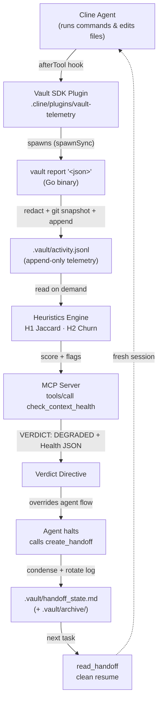
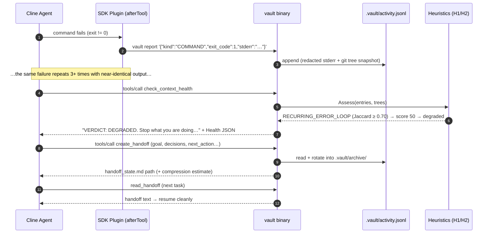
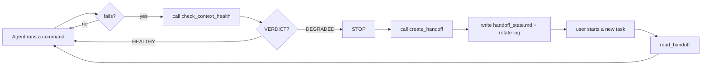

# Vault — Architecture & Design

**Autonomous Context Health & Handoffs for AI Agents.**

This is the master technical document for Vault: a pure-Go (1.21+, standard library only) MCP server that detects **AI-agent context rot** locally and deterministically, then drives the agent into a clean handoff before the session degrades beyond recovery.

Everything here reflects the Phase 7 hackathon submission. This document changes no Go code — it is a faithful description of the implementation under `cmd/` and `internal/`.

---

## Table of contents

1. [System Architecture](#1-system-architecture)
2. [The Mathematics of Context Rot](#2-the-mathematics-of-context-rot)
3. [Autonomous Intervention](#3-autonomous-intervention)
4. [Security & Privacy](#4-security--privacy)
5. [Hackathon Build Story](#5-hackathon-build-story)
6. [Appendices](#6-appendices)

---

## 1. System Architecture

Vault has exactly one job: **observe the agent, decide whether its context is rotting, and — when it is — force a handoff.** It does this with a tiny, deterministic pipeline that never leaves the machine.

### 1.1 The complete lifecycle

The diagram below traces a single agent action from the moment the agent runs a command to the moment a fresh session resumes from the handoff file.



### 1.2 One full degrade-and-handoff cycle



### 1.3 Components and responsibilities

| Component | Path | Responsibility |
|---|---|---|
| **MCP entrypoint** | `cmd/vault/main.go` | Boots the stdio MCP server; exposes the `health`, `report '<json>'`, and hidden `mcp-register` subcommands. |
| **MCP transport** | `internal/mcp/mcp.go`, `internal/mcp/tools.go` | JSON-RPC 2.0 over line-delimited stdio; strict stdout discipline; the four tool schemas. |
| **Persisted state** | `internal/state/state.go`, `internal/state/handoff.go` | Owns `.vault/`: the append-only activity log, health aggregation, the verdict directive, the handoff writer, and log rotation. |
| **Heuristics engine** | `internal/heuristics/heuristics.go`, `churn.go`, `assess.go`, `redact.go` | Pure, offline detection: H1 (Jaccard), H2 (churn), the score aggregator, and RE2 redaction. |
| **Telemetry plugin** | `.cline/plugins/vault-telemetry/index.ts` | The SDK `afterTool` hook; intercepts commands and edits and spawns `vault report`. Observational only — never throws, never mutates tool results. |

### 1.4 Data flow in words

1. **Capture.** The plugin's `afterTool` hook fires after every terminal command and file edit. It extracts the command, the exit code, and the (last 40 lines of) output, then spawns `vault report '<json>'`.
2. **Sanitize & persist.** The Go server redacts secrets from the output, takes a git-tree snapshot (except for read-only `READ` activities), and appends exactly one JSON line to `.vault/activity.jsonl`.
3. **Assess.** On `check_context_health`, the server reads the log, feeds it to the heuristics engine, and returns a plain-language verdict followed by the raw Health JSON.
4. **Intervene.** If the verdict is degraded, the agent halts and calls `create_handoff`, which writes `.vault/handoff_state.md` atomically and rotates the log into `.vault/archive/`.
5. **Resume.** The next session calls `read_handoff` and continues from a clean, compressed state.

The rest of this document opens each box in turn: the **math** (Section 2), the **intervention protocol** (Section 3), and the **security model** (Section 4).

---

## 2. The Mathematics of Context Rot

Vault's detection is **not a black box**. Every flag it raises can be recomputed by hand from `.vault/activity.jsonl`. There are exactly two heuristics, each with a single, explainable decision rule.

### 2.1 Heuristic 1 — Recurring Error Loops

An **error loop** is the agent running the same failing command, getting the same failure back, and trying again without any real change. Vault detects this by measuring how *similar* the last few failing outputs are to one another. Raw text comparison would fail — timings, paths, and line numbers change on every run — so H1 first **normalizes** each output into a stable token set, then compares those sets with **Jaccard similarity**.

#### Step 1 — Candidate selection

Only command-like activities are considered. From the ordered activity log:

1. Keep only entries whose `kind` is `COMMAND` or `TEST`.
2. Require **at least 3** such entries; otherwise return no flag.
3. Take the **last 3** (position in the log defines "last", not timestamps).
4. If **any** of the three has `exit_code == 0`, stop — a success in the middle breaks the loop.
5. If **any** of the three has empty output, stop — there is nothing to compare.

#### Step 2 — Text normalization pipeline

Each of the three outputs is reduced to a sorted, de-duplicated **token set**:

| # | Operation | Purpose |
|---|---|---|
| 1 | Split into lines; skip blank lines and Go-test boilerplate (`PASS`, `FAIL`, `=== RUN`, `--- PASS`, `ok  `, `FAIL\t`, `exit status N`) | Remove noise shared by *every* run |
| 2 | Split each line into whitespace-delimited fields | Tokenize |
| 3 | Drop any field that looks like a **path** (contains `/` or `\`, or ends in `.go`/`.py`/`.ts`/`.js`) | `cache_test.go:41:` differs per run |
| 4 | Strip **hex addresses** (`0x…`), **RFC3339 timestamps**, **clock times**, **durations** (`12ms`, `0.00s`), and **bare numbers** | Timings and counts change every run |
| 5 | Split the remainder on non-alphanumerics; lowercase | Normalize punctuation and case |
| 6 | Drop tokens shorter than 2 characters; de-duplicate; sort | Produce a stable set |

After this pipeline, two runs of the *same* failure — differing only in timing, line numbers, and paths — collapse to **nearly identical token sets**.

#### Step 3 — Jaccard similarity

For two token sets `A` and `B`, the similarity is the size of their intersection divided by the size of their union:

```
J(A, B) = |A ∩ B| / |A ∪ B|
```

- `J = 1.0` → the sets are identical.
- `J = 0.0` → the sets share nothing (two empty sets are defined as `0`, never flagged).
- Example: `A = {fail, testcache, expected, got}` and `B = {fail, testcache, expected, got}` → `|A∩B| = 4`, `|A∪B| = 4`, `J = 1.00`.
- Example: `A = {alpha, beta, gamma}` and `B = {alpha, beta, gamma, delta}` → `|A∩B| = 3`, `|A∪B| = 4`, `J = 0.75`.

#### Step 4 — Decision rule

All **three pairwise** similarities (A·B, B·C, A·C) must be **≥ 0.70** (the `VAULT_JACCARD_MIN` threshold, overridable). If so, Vault raises:

```
RECURRING_ERROR_LOOP
```

with evidence containing the three similarity scores and the tokens **shared by all three** runs.

> **Why 0.70?** Two genuinely different failures share little vocabulary and score well below 0.70; two runs of the same failure score near 1.0. The threshold sits comfortably in that gap, and requiring all three pairs to match means a single coincidental pair can never trigger a flag.

#### Worked example

Three consecutive failing runs:

```
--- FAIL: TestCache (0.00s)
    cache_test.go:41: expected 3, got 2
FAIL
exit status 1
```

After normalization every run collapses to the same set `{fail, testcache, expected, got}` — the `0.00s` duration, the `3`/`2` numbers, and the `cache_test.go:41:` path are all stripped. The three pairwise similarities are therefore `[1.00, 1.00, 1.00]`, all ≥ 0.70, so Vault flags `RECURRING_ERROR_LOOP` and subtracts **50** points from the health score.

#### False-positive guards

- A **success** among the last three `COMMAND`/`TEST` entries aborts detection.
- **Empty output** aborts detection.
- Fewer than **3** command-like entries aborts detection.
- Only `COMMAND`/`TEST` kinds count — `READ`, `EDIT`, and `COMMIT` are ignored.
- Progress output that changes between runs (e.g. "step 1/10" → "step 2/10") normalizes to different token sets and does **not** flag.

### 2.2 Heuristic 2 — Code Oscillation (Net vs Gross Git Tree Churn)

An **oscillation** (thrashing) is the agent moving code back and forth without making net progress — writing 300 lines to end up 20 lines away from where it started. Vault measures this with **git-tree churn**, which needs two ingredients: a safe way to snapshot the working tree, and a way to compare snapshots.

#### Safe snapshots with a temporary `GIT_INDEX_FILE`

To snapshot the working tree without disturbing the developer's real git index, Vault never runs `git add` against the real index. Instead:

1. Resolve the **per-worktree** index path with `git rev-parse --git-path index` (this resolves correctly inside git worktrees).
2. Create an empty temporary file and copy the current index into it (a brand-new repo may not have an index yet — that is fine).
3. Run `git add -A` and `git write-tree` with the environment variable `GIT_INDEX_FILE` pointing at the temp file.
4. `git write-tree` prints a **tree object hash** — a content-addressed snapshot of the entire working tree.
5. Delete the temp file (deferred, so it is removed on every exit path).

The user's real index, staged changes, and working tree are **never modified**. Any failure — `git` missing, or the root not being a repository — returns an empty string and is ignored downstream; Vault never errors out because of git.

> **Why this matters:** the naive approach (`git add -A; git write-tree`) would mutate the developer's staging area as a side effect of *monitoring*. The temp-index technique makes snapshots completely non-invasive, which is exactly what makes it safe to take one on every non-`READ` activity.

#### Net vs. gross churn

Given the ordered list of tree snapshots (empty trees and consecutive duplicates removed), with line counts taken from `git diff --numstat` (binary files count as 0):

- **gross churn** — total lines added + deleted, summed over **every consecutive pair** of snapshots. This is the *total work* the agent did:

  ```
  gross = Σ over i of ( added(tree[i], tree[i+1]) + deleted(tree[i], tree[i+1]) )
  ```

- **net churn** — lines added + deleted between the **first and last** snapshot. This is the *actual progress*:

  ```
  net = added(tree[0], tree[n-1]) + deleted(tree[0], tree[n-1])
  ```

- **efficiency** — the ratio of progress to work:

  ```
  efficiency = net / gross        (0 when gross == 0)
  ```

A productive session has `efficiency` near 1 (almost every changed line is a net change). A thrashing session has `efficiency` near 0 (the agent rewrote the same lines many times to move almost nothing).

#### Decision rule

Vault flags `CODE_OSCILLATION_THRASHING` when the churn is **inefficient** *and* **substantial**:

```
efficiency < 0.15   AND   ( gross > 100  OR  snapshots >= 10 )
```

- `0.15` → `VAULT_CHURN_MAX_EFF`
- `100` → `VAULT_CHURN_MIN_GROSS`
- `10` → `VAULT_CHURN_MIN_SNAPSHOTS`

#### The micro-oscillation gate

Line thresholds alone miss **one-line flip-flopping**: flipping a single line back and forth 12 times produces only `gross = 24`, well under 100, yet it is a textbook thrash. The second clause fixes this — after **10 or more** distinct snapshots, an inefficient session is flagged even when the line counts are small.

#### Worked example

Snapshots `A → B → A → B`, with **100 lines** changed on each hop:

| Quantity | Value |
|---|---|
| gross | 100 + 100 + 100 = **300** |
| net | diff(A → B) = **100** |
| efficiency | 100 / 300 ≈ **0.33** |
| verdict | 0.33 ≥ 0.15 → **not flagged** (real progress) |

Now suppose the *net* change were only **20 lines** over the same three hops:

| Quantity | Value |
|---|---|
| gross | **300** |
| net | **20** |
| efficiency | 20 / 300 ≈ **0.067** |
| verdict | 0.067 < 0.15 and 300 > 100 → **flagged** |

The agent burned 300 lines of churn to move the code 20 lines — that is thrashing.

### 2.3 Aggregation: the health score

The two heuristics are combined into a single 0–100 score, starting at 100:

| Signal | Penalty |
|---|---|
| `RECURRING_ERROR_LOOP` | −50 |
| `CODE_OSCILLATION_THRASHING` | −35 |

The score is clamped to `[0, 100]` and mapped to a status:

| Score | Status | Verdict directive |
|---|---|---|
| ≥ 70 | `healthy` | `VERDICT: HEALTHY. Continue working.` |
| 40–69 | `degraded` | `VERDICT: DEGRADED. …` |
| < 40 | `critical` | `VERDICT: DEGRADED. …` |

Both `degraded` and `critical` render the same stop-and-handoff directive (Section 3). Every threshold is environment-overridable, which let the team tune the demo without a rebuild:

| Variable | Default | Meaning |
|---|---|---|
| `VAULT_JACCARD_MIN` | `0.70` | H1 similarity threshold |
| `VAULT_CHURN_MIN_GROSS` | `100.0` | H2 line-churn threshold |
| `VAULT_CHURN_MAX_EFF` | `0.15` | H2 net/gross ceiling |
| `VAULT_CHURN_MIN_SNAPSHOTS` | `10` | H2 micro-oscillation gate |


---

## 3. Autonomous Intervention

Detection is only half the product. The other half is **making the agent act on it**. Vault does not merely report a number — it returns a natural-language directive written to override the agent's default behavior.

### 3.1 The verdict directive

`check_context_health` returns a directive line **followed by** the raw Health JSON, so the agent gets both an imperative and the evidence behind it:

| Condition | Directive returned |
|---|---|
| `status == "healthy"` | `VERDICT: HEALTHY. Continue working.` |
| `status == "degraded"` or `"critical"` | `VERDICT: DEGRADED. Stop what you are doing. You are thrashing. Call create_handoff immediately and ask the user to start a new task.` |

The degraded directive is deliberately blunt. It names the failure ("You are thrashing"), issues an unambiguous command ("Stop what you are doing"), and specifies the exact next action ("Call create_handoff immediately and ask the user to start a new task"). There is no ambiguity for the agent to rationalize away.

### 3.2 How the directive overrides the agent's flow

A verdict only matters if the agent obeys it. Vault guarantees that by pairing the tool with an **agent rule** the user adds to `.clinerules`:

```text
After any failing command, call check_context_health. If the verdict is DEGRADED, stop and call create_handoff. At the start of a new task, call read_handoff.
```

`make install` appends this rule automatically. The result is a closed control loop:



The critical design point: **the agent's own system prompt tells it to obey the verdict**, so a `VERDICT: DEGRADED` directive short-circuits the "try one more fix" instinct that causes the rot in the first place.

### 3.3 The handoff artifact

`create_handoff` condenses the entire session — both the agent's own summary fields and the machine-derived activity history — into `.vault/handoff_state.md`. The file has a fixed, ordered structure so a fresh agent always knows where to look:

| Section | Contents |
|---|---|
| `# Vault Handoff` + resume line | A one-line instruction to continue from the next action and not repeat failed attempts |
| `## Goal` | The agent-supplied goal |
| `## Architecture & Decisions` | The agent-supplied decisions and rationale |
| `## Touched Files & AST Scope` | The de-duplicated union of every file touched, in first-seen order |
| `## Completed Work` | The agent-supplied summary of what was done |
| `## Current Blocker & Active Errors` | The agent-supplied blocker plus the last 3 failing outputs (each truncated to 40 lines) |
| `## Failed Attempts (Do Not Repeat)` | The agent-supplied list of dead ends |
| `## Next Immediate Action` | The single next step for the new session |
| `## Git State & Checkpoint Tag` | Workspace path, branch, short HEAD hash, and `git status --porcelain` (or `git unavailable`) |
| `Vault Compression Estimate` footer | A token estimate of how much activity was condensed into the handoff |

The file is written **atomically** (temp file + rename), so a crash can never leave a half-written handoff. The entire body is redacted (Section 4) before it is persisted.

### 3.4 Log rotation

Immediately after a successful handoff write, the activity log is moved to `.vault/archive/activity-<UTC-timestamp>.jsonl` and a fresh, empty log begins. This gives the new session a **clean slate**: the next `check_context_health` starts from 100 with no inherited flags from the previous, rotting session.

### 3.5 The compression estimate

The footer quantifies the value of the intervention. Tokens are estimated as `characters / 4`:

```
Vault Compression Estimate: Condensed ~X tokens of activity history into ~Y tokens of handoff state. (Saved ~Z tokens).
```

`X` is the total characters of every `command` and `stderr` field in the activity history; `Y` is the length of the final handoff file. Because the footer is itself part of the file, `Y` is computed to a **fixed point** — the calculation re-runs until the digit count of `Y` stops changing its own length. The savings are floored at zero.


---

## 4. Security & Privacy

Vault runs inside the developer's repository and observes their terminal output, so its security model is deliberately conservative: **nothing leaves the machine, and nothing sensitive is ever written to disk.**

### 4.1 Threat model

| Threat | Vault's posture |
|---|---|
| Secrets leaking into telemetry | Redacted before persistence (4.2) |
| Telemetry exfiltration | No network code exists; Vault is fully offline |
| Tampering with the developer's git state | Snapshots use a temporary index; the real index is never touched (4.3) |
| Command injection | No shell is ever invoked — subprocesses use argument arrays (4.4) |
| Denial of service via crafted regex | RE2 guarantees linear-time matching (4.2) |

### 4.2 The redaction engine (`redact.go`)

Every piece of text that reaches disk — the `stderr` field of an activity record and the entire handoff body — passes through a pure, deterministic redaction pass first. It masks four classes of secrets:

| Class | Pattern (Go RE2) | What is masked |
|---|---|---|
| **PEM private keys** | `-----BEGIN [A-Z ]*PRIVATE KEY-----[\s\S]*?-----END [A-Z ]*PRIVATE KEY-----` | The entire key block |
| **Bearer tokens** | `(?i)(\bBearer\s+)[A-Za-z0-9._~+/=-]+` | The token (the `Bearer` word is kept) |
| **API keys** | `sk-[A-Za-z0-9]{20,}` | The whole key |
| **KEY=value pairs** | `(?i)(\b[\w.-]*(?:key\|token\|secret\|password)[\w.-]*\s*=\s*)(?:"[^"]*"\|'[^']*'\|[^\s,;]+)` | The value (the key and `=` are kept) |

Each match is replaced with `[REDACTED]`.

**Why RE2?** Go's `regexp` package uses the RE2 engine, which guarantees **linear-time** matching in the length of the input. Catastrophic backtracking — the class of bug that lets a malicious input freeze a PCRE-based redactor (ReDoS) — is impossible by construction. This is why redaction can safely run on untrusted terminal output.

**Timing.** Redaction happens at **write time**, not read time: `report_activity` redacts `stderr` before appending the line, and `buildHandoff` redacts the whole assembled document before the atomic write. A secret that is never written can never be leaked later.

**Accepted trade-off.** The `KEY=value` rule is intentionally substring-based, so an identifier such as `hockey` (which contains "key") is treated as a secret name and its value is masked. This is the deliberate false-positive-for-false-negative trade: Vault would rather over-redact than ever leak a credential.

### 4.3 Git safety

The snapshot technique (Section 2.2) is a security control as much as a correctness one. By copying the real index to a temp file and setting `GIT_INDEX_FILE` to that copy, Vault can run `git add -A` and `git write-tree` **without ever mutating the developer's staged changes or working tree**. Monitoring must never have side effects on the thing being monitored.

### 4.4 No shell, no network

- **No network.** The module imports only the Go standard library and makes zero outbound connections. There is no telemetry home, no analytics, and no update check.
- **No shell execution.** Subprocesses are launched with `exec.Command` (Go) and `spawnSync` (Node) using **argument arrays**, never a shell string — eliminating command-injection surface entirely.
- **stdio discipline.** The MCP server writes **only** JSON-RPC to stdout and sends all logging to stderr, so protocol integrity is never at risk from a stray log line.

### 4.5 Known limitations

Vault is a tripwire, not a judge. The pre-flight audit (`docs/AUDIT.md`) documents the honest limits, including: a multi-megabyte single stdin line is buffered before its 4 MB cap is applied; archive filenames have one-second resolution; redaction does not cover every conceivable key format; and the heuristics are thresholds — false positives and false negatives are possible by construction.


---

## 5. Hackathon Build Story

Vault was built **entirely by Cline**, the autonomous coding agent, during the hackathon. Every phase followed the same loop: the user supplied a phase prompt, Cline planned, implemented, ran `make verify`, committed, tagged, and wrote a phase report. No Go code was hand-written outside the agent.

### 5.1 Phase-by-phase

| Phase | What was built | Tag |
|---|---|---|
| **0** | Repo scaffold: Makefile (`fmt`/`vet`/`test`/`build`), `.clinerules`, ARCHITECTURE.md | `phase-0-done` |
| **1** | Minimal stdio JSON-RPC 2.0 MCP server (initialize, tools/list, tools/call) | `phase-1-done` |
| **1b** | Activity log, workspace argument, `read_handoff`, log rotation | `phase-1b-done` |
| **2** | H1 error-loop (Jaccard), H2 churn (git trees), health scoring | `phase-2-done` |
| **3** | Telemetry SDK plugin (`afterTool` hook) | `phase-3-done` |
| **3b** | Fix: route every record through `vault report` so the git snapshot is taken server-side | `phase-3b-done` |
| **3c** | READ rows skip snapshots; micro-oscillation snapshot gate | `phase-3c-done` |
| **4** | Verdict directives, redaction, handoff compression footer | `phase-4-done` |
| **4b** | Pre-flight architectural & security audit (`docs/AUDIT.md`) | — |
| **5** | `demo-trap/`: a deliberately broken module for live demos | `phase-5-done` |
| **6** | One-command install (`make install`), README, GitHub push | `phase-6-done` |
| **7** | Submission documentation (this file, README, build story) | `phase-7-done` |

### 5.2 The pivots that shaped the product

1. **From "ask the LLM to self-report" to an automatic hook (Phase 1b → 3).** The first design asked the agent to call `report_activity` itself. Across an entire session the agent called it **zero times** — a self-reporting health check is worthless if the patient forgets to take their own vitals. Telemetry had to be invisible, which is why it now lives in an SDK `afterTool` hook.
2. **The snapshot-bypass bug (Phase 3b).** The first plugin wrote `activity.jsonl` directly, bypassing the Go server — so the `tree` field was never populated and H2 churn was blind to all plugin-recorded activity. The fix — routing every record through `vault report` so the server takes the snapshot at record time — is why the plugin spawns the binary today.
3. **Replacing the HTMX web UI with pure MCP telemetry (Phase 4c).** A real-time HTMX dashboard (`vault serve`) was built to visualize context health. In practice it felt broken and non-interactive, and it added a port, a process lifecycle, and a whole second surface to maintain. It was **removed entirely** at the user's request. The lesson hardened into a core design decision: **stdio MCP over HTTP, always** — the consumer is the agent, not a human with a browser. Reliability and speed beat a pretty dashboard.

### 5.3 Honesty statement

- **All code was written by Cline**, driven by the user's phase prompts. The raw, unedited session logs are archived on the build machine and in Cline's session history; they are not cherry-picked.
- **One `.clinerules` edit was made outside Cline** (commit `d931f91`, adding an "Autonomous Health Monitoring" section). It was later superseded by the Cline-written rule text merged in Phase 6.
- **The `demo-trap/` module is a scripted demonstration** — deliberately broken, honestly labelled, and containing no code that sabotages or reverts an agent's fix.

### 5.4 Why this is a complete loop

The project is a demonstration of the exact loop it was built to break: an AI agent (Cline) wrote a tool (Vault) that detects when an AI agent is stuck in an error loop or thrashing code — and then **used that tool on itself** while building it. The telemetry plugin recorded Cline's own commands, the heuristics scored Cline's own sessions, and the handoff file carried context between Cline's own tasks. Vault is not a toy that models agent behavior; it is the instrument that ran throughout its own construction.


---

## 6. Appendices

### Appendix A — Package map

| Package / file | Role |
|---|---|
| `cmd/vault/main.go` | Entrypoint; MCP server plus the `health` / `report` / `mcp-register` subcommands |
| `cmd/vault/mcp_register.go` | Idempotent merge of the `vault` entry into `cline_mcp_settings.json` (backup + preserve other servers) |
| `internal/mcp/mcp.go` | stdio JSON-RPC 2.0 loop; 4 MB line cap; notifications unanswered; `-32700`/`-32601` handling |
| `internal/mcp/tools.go` | The four tool definitions and their JSON Schemas |
| `internal/state/state.go` | Activity log, health aggregation, verdict directive, `read_handoff` |
| `internal/state/handoff.go` | Handoff writer (atomic), log rotation, git state, compression footer |
| `internal/heuristics/heuristics.go` | H1: normalization + Jaccard + error-loop detection |
| `internal/heuristics/churn.go` | H2: safe git snapshots + net/gross churn + oscillation detection |
| `internal/heuristics/assess.go` | Score aggregation, status mapping, env-overridable thresholds |
| `internal/heuristics/redact.go` | RE2 secret redaction |
| `.cline/plugins/vault-telemetry/index.ts` | SDK `afterTool` hook; spawns `vault report` |

### Appendix B — Data formats

**`.vault/activity.jsonl`** — one JSON object per line:

```json
{"time":"2026-10-04T10:00:00Z","kind":"COMMAND","command":"go test ./...","exit_code":1,"stderr":"…redacted…","files":["a.go"],"workspace":"/abs/path","tree":"4b825d…"}
```

- `kind` ∈ `READ | EDIT | COMMAND | TEST | COMMIT`.
- `stderr` is already redacted at write time.
- `tree` is present only for non-`READ` activities (the git snapshot).

**`.vault/handoff_state.md`** — fixed H2 section order (see Section 3.3) plus the compression footer.

**Health JSON** (the payload after the verdict line):

```json
{"score":100,"status":"healthy","flags":[],"reason":"no context-rot signals detected.","recommendation":"continue","metrics":{"similarities":[],"net":0,"gross":0,"efficiency":0,"activity_count":13}}
```

### Appendix C — Environment variables

| Variable | Default | Purpose |
|---|---|---|
| `VAULT_ROOT` | cwd | Project root Vault persists state under |
| `VAULT_BIN` | `<workspace>/bin/vault`, else `PATH` | Binary the telemetry plugin spawns |
| `VAULT_JACCARD_MIN` | `0.70` | H1 similarity threshold |
| `VAULT_CHURN_MIN_GROSS` | `100.0` | H2 line-churn threshold |
| `VAULT_CHURN_MAX_EFF` | `0.15` | H2 net/gross ceiling |
| `VAULT_CHURN_MIN_SNAPSHOTS` | `10` | H2 micro-oscillation gate |
| `CLINE_MCP_SETTINGS` | auto-detected | Overrides the settings file path for `make install` |

### Appendix D — Failure modes and honest limitations

From the pre-flight audit (`docs/AUDIT.md`), still current at Phase 7:

- **MEDIUM-1:** the MCP server buffers a stdin line fully *before* applying its 4 MB cap — an adversarial multi-megabyte line costs ~2× its size in memory (measured: a 30 MB line → 66 MB RSS). Unreachable from normal clients; hardening planned.
- **LOW-2:** archive filenames have one-second resolution; two handoffs in the same second overwrite the previous archive.
- **LOW-3:** the activity-log append follows symlinks (trusted-workspace threat model).
- **LOW-4:** telemetry payloads above the OS argv limit (~128 KB) are dropped with a logged error, not corrupted.
- **LOW-5:** every snapshot writes unreachable tree objects into `.git/objects` (git gc reclaims them).
- **LOW-6:** each non-`READ` activity pays a full-tree snapshot cost.
- **LOW-7:** requests over the 4 MB line cap are answered `-32700` and dropped by design.
- **LOW-8:** redaction masks substring matches (`hockey=1` becomes `hockey=[REDACTED]`) and does not cover non-`sk-` key formats.
- **Plugin host limit:** the `afterTool` hook loads only in Cline SDK/CLI/Kanban hosts; VS Code extension users record activity manually.
- **Heuristics are thresholds, not truths:** a short Jaccard window can miss slow-rot loops, and churn measures lines, not intent. The verdict is a tripwire, not a judge.

### Appendix E — Testing strategy

- **Test-first, table-driven:** every heuristic has table-driven unit tests fed by fixtures under `testdata/heuristics/`, including false-positive cases (a success in the middle breaks the loop; only `COMMAND`/`TEST` count; fewer than 3 relevant entries; empty output; progress output that must NOT flag).
- **Integration tests** drive real git repositories (skipped when git is absent) and the full MCP transcript through the real server loop.
- **Race detector:** `go test -race ./...` is part of the audit gate.
- **Empirical audit:** `docs/AUDIT.md` additionally measured fd stability across 100 writes, 40 parallel appenders, temp-file leak counts across forced git failures, oversized-line memory, and adversarial redaction timing.
- **`make verify`** = `fmt-check` + `vet` + `test` + `build`, and must be green before every commit.

